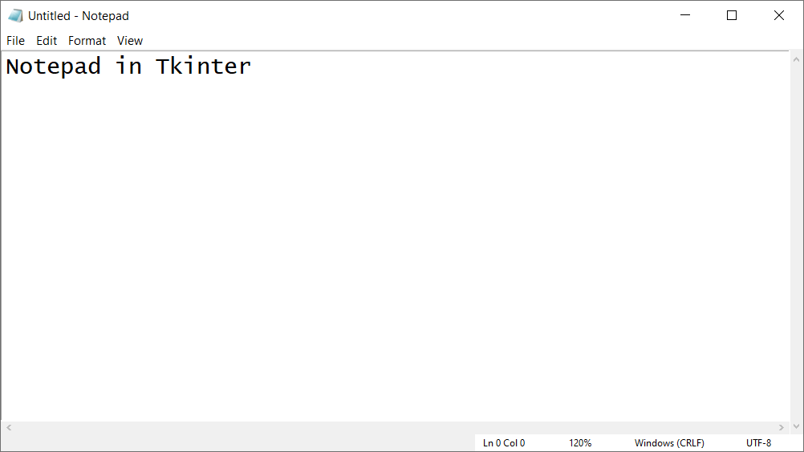

# Notepad-Tkinter-Recreation
This Program will attempt a complete recreation of Microsoft Notepad with Tkinter with all the features included.

# Features Included
- The ability to save, open update, and create new text files.
- The ability to find and replace certain strings and letters in the text was created from scratch.
- Select/All and Time/Date.
- Format Menu lets user edit and preview the font style, size, and type.
- Zoom in and out and the ability to remove the status bar.
- Multiple windows can be opened and used simultaneously.
- Program is complete, might return later if I find any issues or want to add new features.

# Getting Started
To run the application simply run the python file. Run the following line in the working directory:

> python notepadGUI.py

# License
Notepad Tkinter Recreation uses the MIT License.
